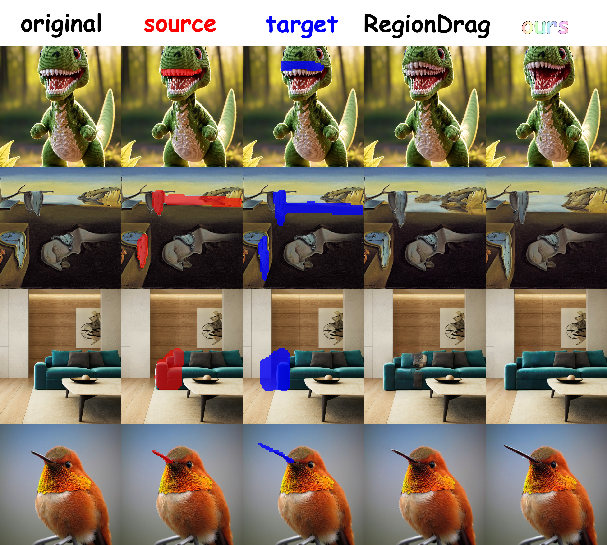

# Region-based Drag Editing with Self-Guided Diffusion



This repository contains the code for a Bachelor's thesis project completed at the Faculty of Computer Science, Higher School of Economics.

**Author:** Danil Sheshenya

**Supervisors:** Aibek Alanov & Alexandra Ivanova

## Installation

1.  Clone this repository.
2.  Install dependencies:

    ```bash
    pip install -r requirements.txt
    ```
3.  Download the DragBench-SR and DragBench-DR datasets from the [RegionDrag](https://github.com/Visual-AI/RegionDrag) repository and place them in the `drag_data` directory.

## Usage

Example scripts are available in the `scripts` directory. To run the baseline method, for example:

```bash
bash scripts/run-guidance-baseline.sh
```